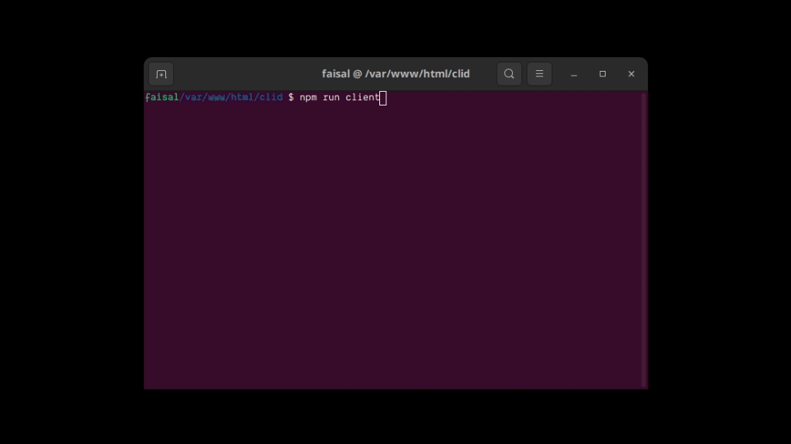

# CLID — The CLI Dating App

> **CLID** (*CLI-Dating*) is a little side-project/experiment — a **dating app right from your terminal**  
> Browse profiles, like people, get matches — all from your command line!  
> Matching purely based on vibes and not the showey-show stuff unlike other UI based dating applications


---

## Tech Stack

**Backend:** Node.js, Express

**Frontend (CLI):** Ink (React for CLI)

**Database:** SQLite

**Language:** JavaScript

**Environment:** Cross-platform (macOS / Linux / Windows)

---

## Features

- **Profile Management**
- **Browse Users**
- **Swipe Mechanism**
- **SQLite Database** — Lightweight local storage, easy to inspect and extend
- **Node.js Backend + Ink Client** — Combines Express power with Ink’s CLI UI

---

## Sneak Peek

Here’s a glimpse of CLID in action:



---

## Project Structure

I have tried to keep the structure fairly straightforward and intuitional. I have also tried to keep the code modular and functions and files small. Although, I have developed server and client separately, leading to 2 different packages existing as one big package.

```
clid/
├── server/
│ ├── index.js                      # express app
│ ├── .env                          # rename .env.example and change variables
│ ├── db.js                         # better-sqlite3 database
│ ├── middleware/                   # pre-checks before passing them routes
│ ├── routes/                       # sanitizing incoming requests and responding
│ ├── models/                       # helper methods used in routes
│ └── package.json
│
├── client/
│ ├── index.jsx                     # Ink app
│ ├── components/                   # UI component wrappers and app logic
│ │ └── forms/                      # Actual UI components
│ ├── hooks/                        # hooks used across the app
│ ├── utils/                        # utility functions
│ └── package.json
│
├── data/                           # seed files and clid.db auto-generated during development
│
├── package.json
└── README.md
```

---

## Installation

### Clone the repository
```bash
git clone https://github.com/faisalAkhtar/clid.git
cd clid
```

### Install dependencies
```bash
cd <repo>/server/
npm install
cd <repo>/client/
npm install
```

### Edit the environment file
```bash
mv .env.example .env
vim .env        # replace secrets
```

### Edit the api file

You might need to edit the API_URL in `<repo>/client/utils/api.js`. I have it pointed to my localhost (I use http://faisal.com lol)

### Run the server and client

```bash
cd <repo>
npm run server
npm run client
```

### Tips and Tricks

- When you run server, if you are still in development mode
    - server will seed some dummy users
    - when you create a new user, server will seed some dummy likes for this new guy
    - please note that I used chatgpt to generate seed files, they are just placeholders used for development.
- You can change the mode in your .env file
- The server runs on port 5000 by default. You can change that too in .env file

**NOTE :** The password here is just a placeholder and isn't actually verified because I was least worried about it.
I just needed to dive into the heart of this project which is the browsing and swiping.
Which is why most of the profile info is optional. You just need a unique username and that's about it.

---

## API Endpoints

| Endpoint              | Method | Description              |
|-----------------------|--------|--------------------------|
| `/auth/signup`        | POST   | New user                 |
| `/auth/signin`        | POST   | Login                    |
| `/auth/signout`       | POST   | Logout                   |
| `/profile`            | GET    | View user profile        |
| `/profile`            | PUT    | Edit user profile        |
| `/browse`             | GET    | Fetch relevant profiles  |
| `/browse/swipe`       | POST   | Like / Pass a profile    |
| `/browse/matches`     | GET    | View current matches     |

---

## Contributing and Future Scope

Contributions, issues, and pull requests are more than welcome.

If you find a **bug**, have a **feature idea**, or want to **improve the UX**, just open an [Issue](../../issues) — or send a PR (even better)

Off the top of my head, here are a few things I think this project can have:

- **Chat System** (real-time messaging)
- **Online Mode**
- **CLI Notifications / Match Alerts**
- **Smarter profile browsing algorithms**
- **Profile Prompts & Theming**
- **Some basic animations in the UI**

I will add a few in the [issues](../../issues) myself, you can contribute to it too.

---

## License

This project is open source under the **MIT License**. See [LICENSE](./LICENSE) for details.

---

## Bottomline

> CLID started as a fun side project to stroke my self-worth (I miss JavaScript and my ability to just create things sometimes just for the sake of it) —
> but who knows, maybe someone *will* find love through it someday ;)
>
> Feel free to fork, tinker, and play around (and please mention me if you guys do)
> Have fun coding & swiping!

---

### Star the repo if you like it!

[](https://github.com/faisalAkhtar/clid)
